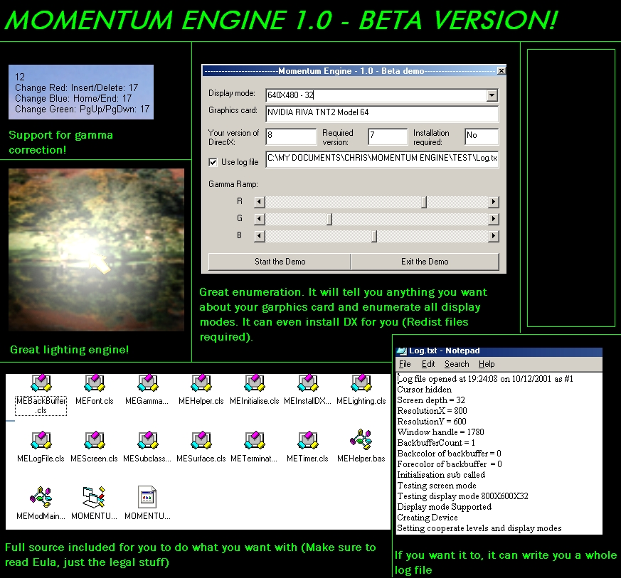



## A DirectX 2D Graphics Engine

### Description

This state of the art 2D engine has loads of features including special lighting, and gamma correction. It has lots of extra helper libraries such as the brand new automatic logging capability for easy error pinpointing. The great error lookuo table allows you to look up any errors returned and get a description. With fast graphics blitting, and lots of special features, this engine will really help even the novice programmer to create blisteringly fast, smooth games. Remember to vote and give your feedback.
 
### More Info
 
Read ReadMe.txt

Don't rip me apart if it dousn't support your graphics card. No guarantees.

             |
---                |---
**Submitted On**   |2001-12-11 16:57:00
**By**             |[IRBMe](https://github.com/Planet-Source-Code/PSCIndex/blob/master/ByAuthor/irbme.md)
**Level**          |Intermediate
**User Rating**    |4.5 (36 globes from 8 users)
**Compatibility**  |VB 5\.0, VB 6\.0
**Category**       |[Graphics](https://github.com/Planet-Source-Code/PSCIndex/blob/master/ByCategory/graphics__1-46.md)
**World**          |[Visual Basic](https://github.com/Planet-Source-Code/PSCIndex/blob/master/ByWorld/visual-basic.md)
**Archive File**   |[DirectX\_2D4113212112001\.zip](https://github.com/Planet-Source-Code/irbme-a-directx-2d-graphics-engine__1-29671/archive/master.zip)

